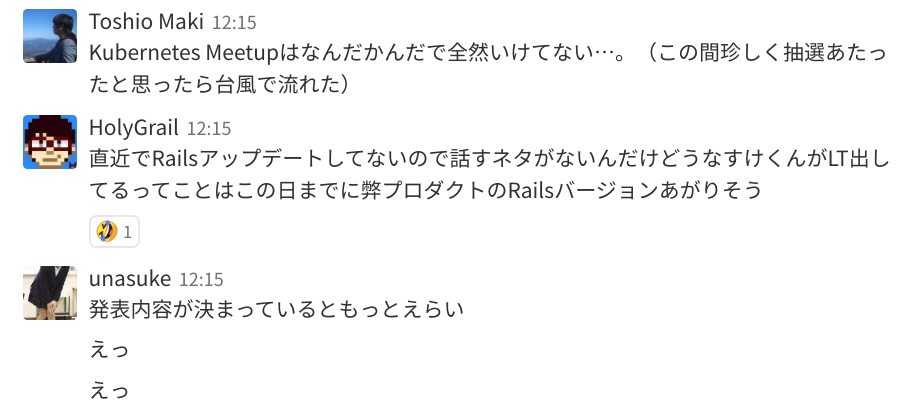
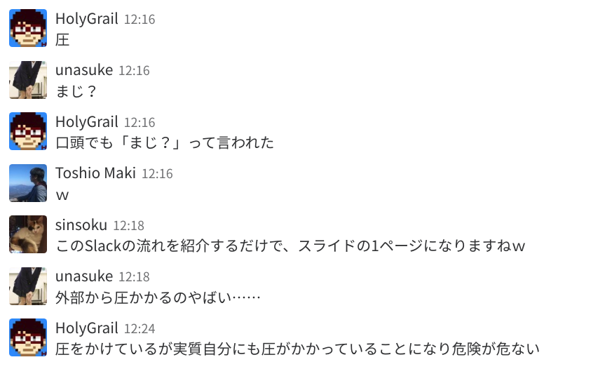
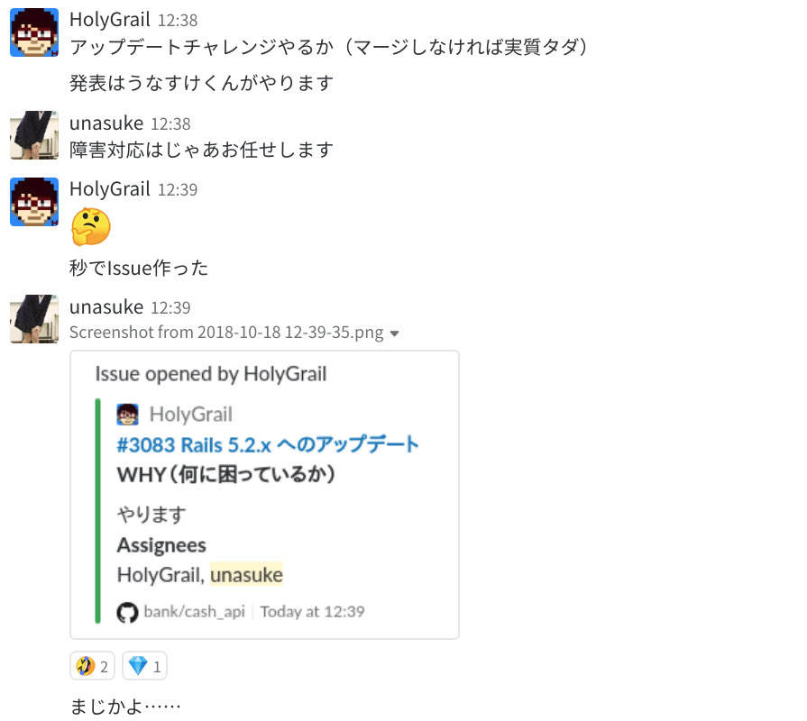
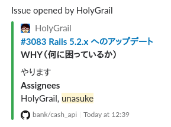
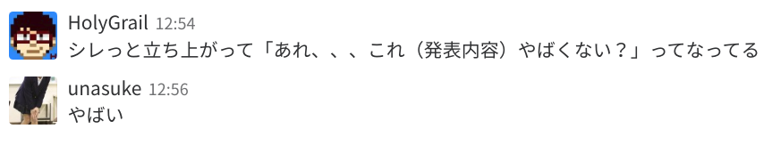
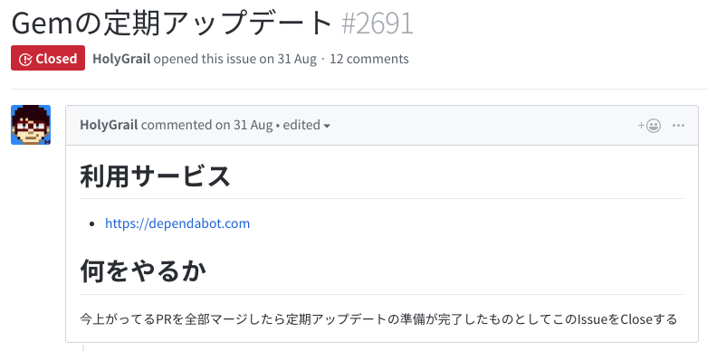
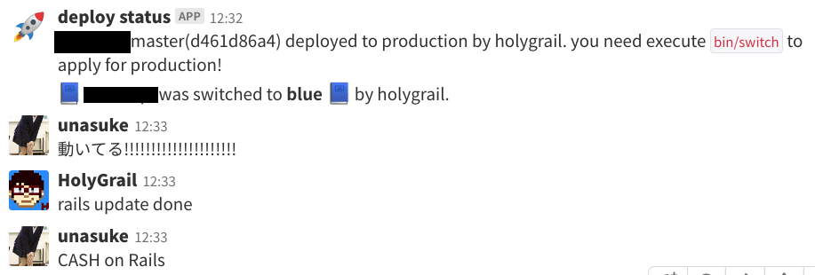
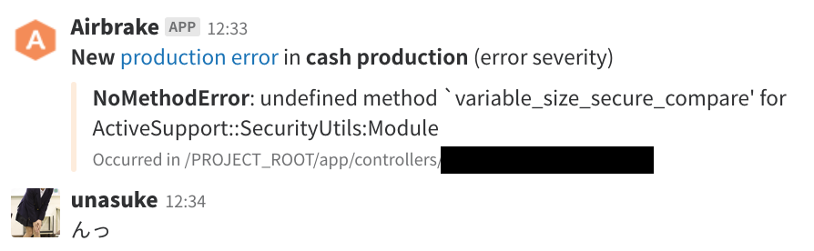

# Rails 5.2.1 ですが何か
subtitle
: 2018-11-08

subtitle
: 表参道.rb #40

author
: うなすけ

theme
: unasuke-white

# 自己紹介
- 名前 : うなすけ
- 所属 : 株式会社バンク (エンジニア)
  - インフラ寄りサーバーサイドエンジニア
  - 業界4年目

- {::tag name="x-small"}GitHub [@unasuke](https://github.com/unasuke){:/tag}
- {::tag name="x-small"}Mastodon [@unasuke@mstdn.unasuke.com](https://mstdn.unasuke.com/@unasuke){:/tag}
- {::tag name="x-small"}Twitter [@yu\_suke1994](https://twitter.com/yu_suke1994){:/tag}

{:relative_width="24" align="right" relative_margin_right="-10" relative_margin_top="42"}

# 皆さん
```diff
-gem 'rails', '5.1'
+gem 'rails', '~> 5.2.1'
```

{:.center}
やってますか？

# 発端
{:relative_width="100"}

# 発端
{:relative_width="100"}

# 発端
{:relative_height="100"}

# 発端
{:relative_height="100"}

# 問題発生
{:relative_width="100"}

{:.center}
{::tag name="x-large"}やばい{:/tag}

# どうしてこうなったクイズ
1. 定期的に `bundle update` をしていたから
1. 便利ツールを使ったから
1. 社内に `rails/rails` を監視している暇人がいたから

{:.center}
せいかいはどれ？

# 定期的な `bundle update`
{:relative_width="100"}

[https://dependabot.com/](https://dependabot.com/)

# bundle update tools
- [masutaka/circleci-bundle-update-pr](https://github.com/masutaka/circleci-bundle-update-pr) 
  - 内部では結局 `bundle update`
- [https://www.deppbot.com/](https://www.deppbot.com/)
  - なぜか `Gemfile` を認識せず
- [https://dependabot.com/](https://dependabot.com/)
  - CVE 出たら即座に上げてくれたりと便利
- 人力 cron (一時期やってた)

# 便利ツール
- [Ruby on Rails 5.2 リリースノート \| Rails ガイド](https://railsguides.jp/5_2_release_notes.html)
   - 便利っていうか必読
- [http://railsdiff.org/](http://railsdiff.org/)
  - 各バージョンでの `rails new` のdiffが見れる

# ところで 5.1 → 5.2
- ActiveStorage
- Redis Cache Store
- HTTP/2 Early Hints
- Credential
- CSP

何ひとつ使用してませんが……

# なんやかんやで
{:relative_width="100"}

update 成功 🎉🎉🎉🎉

# アクシデントは、あった
{:relative_width="100"}

private api を使っていた……

※ `:nodoc:` がついてたら private api です

# 大事なこと
- 新機能の開発に追われてても基盤改善の時間は確保する
  - 確保するというか、草の根的にやる
  - 次第に任されるようになる
- いつも手元に git clone rails
  - GitHubにアクセスするより速い
- private api を使わない